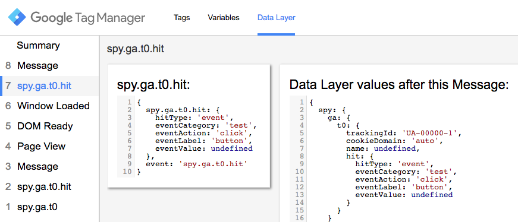
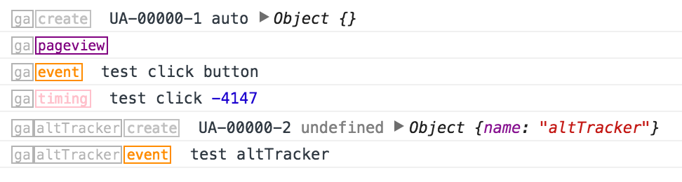

# Google Analytics Spy

This is a listener for messages sent to Google Analytics JavaScript tracking library.

The focus is listening to integrations with analytics.js (Universal Analytics).
There is a version of this listener for asynchonous tracking with ga.js, but it is not actively maintained, 
and may be missing bugfixes and features present in the Universal Analytics listener.

## Uses

This started out as a GTM listener for non-GTM-based GA tracking (hardcoded tracking),
to either: block it, or use it trigger/inform GTM-based tracking, or both.
But there are many more uses in GTM and out.
- Detect/block non-GTM (hardcoded) tracking
- Populate data layer from non-GTM tracking
- Migrate to GTM
- Log GA Commands
- Queue hits from GTM until GTM pageview fired.
- Enforce field values or provide defaults for GTM hit tags (in lieu of GTM interface support for creating tracker or defining hit defaults).
- Build in protection against oversized or malformed hits.
- Track your tracking (that's a bad idea, isn't it?) (...But actually think about it: dims/metrics format validation, PII detection/blocking. Can integrate with trackinn impl, but doesnt capture all)


## Usage

### Installation in GTM

To use in GTM, place the contents of ga-spy.gtm.tag.html into a custom html tag,
then use one of the custom listeners below.

If you use ga-spy.gtm.tag.html as the Tag, then you can place the listsner code into
a Variable named `GA Spy Config` (using ga-spy-config.gtm.var.js as a template). 
This way, you can easily update the core GA Spy without having
worry about preserving your custom code.  
Placing the config directly into the GA Spy tag is fine, too.

#### Alternatives

Adding GA Spy in your website source code may be the only option for special cases.  
For instance, in order to intercept ga commands that run upon page load or 
shortly thereafter (such as commands in the base GA install snippet), 
GA Spy should be included above the first GA command. Cannot use `async` or `defer` 
attributes if deploying as external script.


### Configuration

The listener is run by calling `gaSpy`, passing a configuration object as the sole argument:

```javascript
gaSpy( {
  
  // Set true to activate logging and avoid try/catch protection. Default: false.
  'debug' : false,
  
  // String with which to prefix log messages. Default: "gaSpy".
  'debugLogPrefix' : 'gaSpy',
  
  // The name of the global ga object. Default: "ga".
  'gaObjName' : 'ga',
  
  // Function to call whenever `ga()` is called.
  // Return false to prevent command from being passed to analytics.js.
  'callback' : function( 
  
    args, // Array of arguments passed to `ga()`.
          // https://goo.gl/muCY7Q
    
    the,  // Object including tracker name, plugin name/method/etc parsed from the command.
          // the.command
          // the.trackerName
          // the.hitType
          // the.pluginName
          // the.pluginMethodName
          // the.callback
  ){
  	// Your custom code goes here.
  }
  
} );
```

This can also be simplified by simply passing the callback function without wrapping it in the configuration object:

```javascript
gaSpy( function( args, the ){
  	// Your custom code goes here.
} );
```

The original behavior (passing commands onto `ga` is done by default, and any errors
thrown from the listener will be silenced (unless `config.debug=true`) and typical 
behavior will not be affected.


### Examples

#### Block non-GTM (hardcoded) tracking

The listener function below will block all commands except those sent from GTM.
(With the exception of custom callbacks, since the source/purpose would be unknown.)

```javascript
gaSpy( function gaSpy_cb_( a, the ){

	// Allow all commands from GTM.
	if( the.trackerName && the.trackerName.substr( 0, 3 ) == 'gtm' ) return;

	// Do not block custom callbacks.
	if( the.callback ) return;
	
	// Block everything else!
	return false;
})
```


#### Populate data layer from non-GTM tracking

For a robust solution that handles preservation of tracker fields and also wipes hit-only fields after the relevant GTM event, check out [examples/ga-spy-datalayer](examples/ga-spy-datalayer.preview.html).




#### Hardcoding GA Spy

If you were to deploy this on page, it's probably better to include gaSpy inline rather than an external script.
Remember only reason for on-page is to capture pageload-based tracking, and using async or defer is not an option.
Do not use the gaSpy.js URL from the examples in a production site.  Host it yourself or place it inline.


#### Hardcoding GA Spy : Migrate to GTM

This can be used to have a seamless migration to GTM without needing to coordinate simultenous updates.
The catch is that gaSpy needs to be deployed on-page for this to be effective.

TODO


#### Log GA Commands

Logging GA commands are a useful way to easily see what commands are being 
picked up by GA Spy, letting you see which things GA Spy can block and/or latch 
on to to fire custom behavior.

Compared with the other tracking logging tools and the verbose analytics_debug.js, 
GA Spy logging can be very minimalistic, but it's custom so you could log using
emojis if you wanted. And it has the adavantage of working even when the
hit does not fire (e.g. not affected by opt-out/tracking-blockers), or 
when previewing an html file locally, etc.

When used in tandem with other loggers, this log will always be listed first.

This listener callback will print `ga()` arguments exactly as they are given:

```javascript
gaSpy( function gaSpy_cb_( a ){
	// Log arguments for debugging.
	console.debug.apply( console, a )
})
```

Or check out [examples/ga-spy-log](examples/ga-spy-log.html) for a more robust example.

    
    
# Contributing

Versioning follows http://semver.org (or at least tries to).

Licensed under the MIT license.


